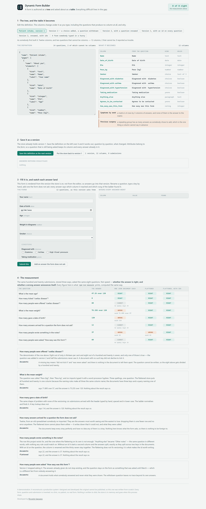
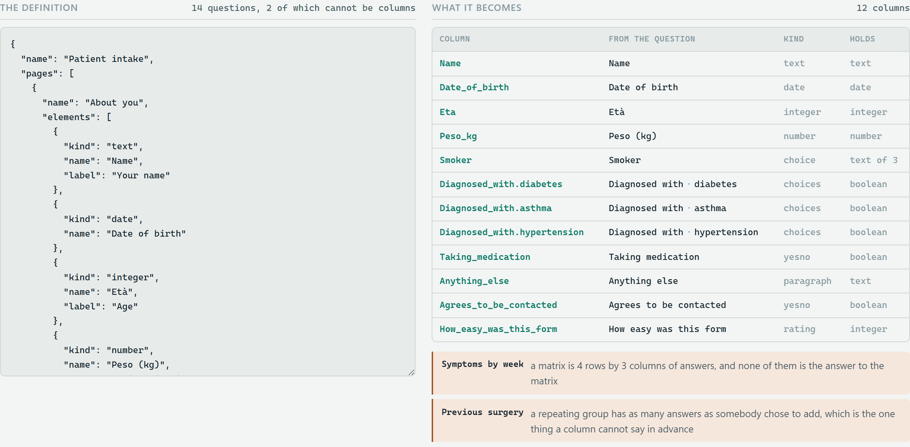
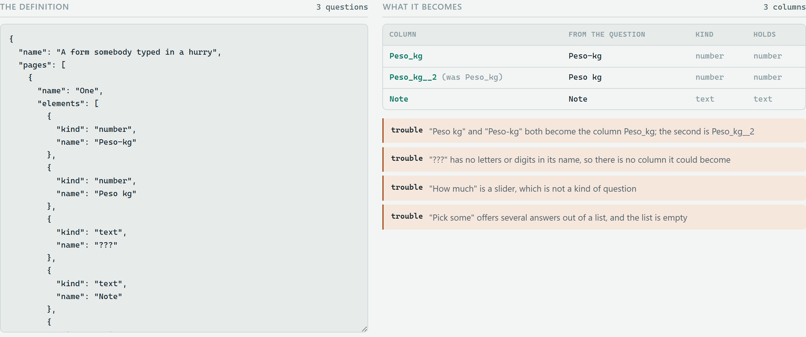
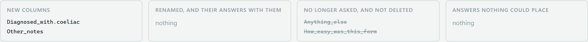
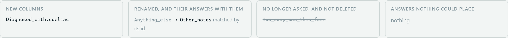
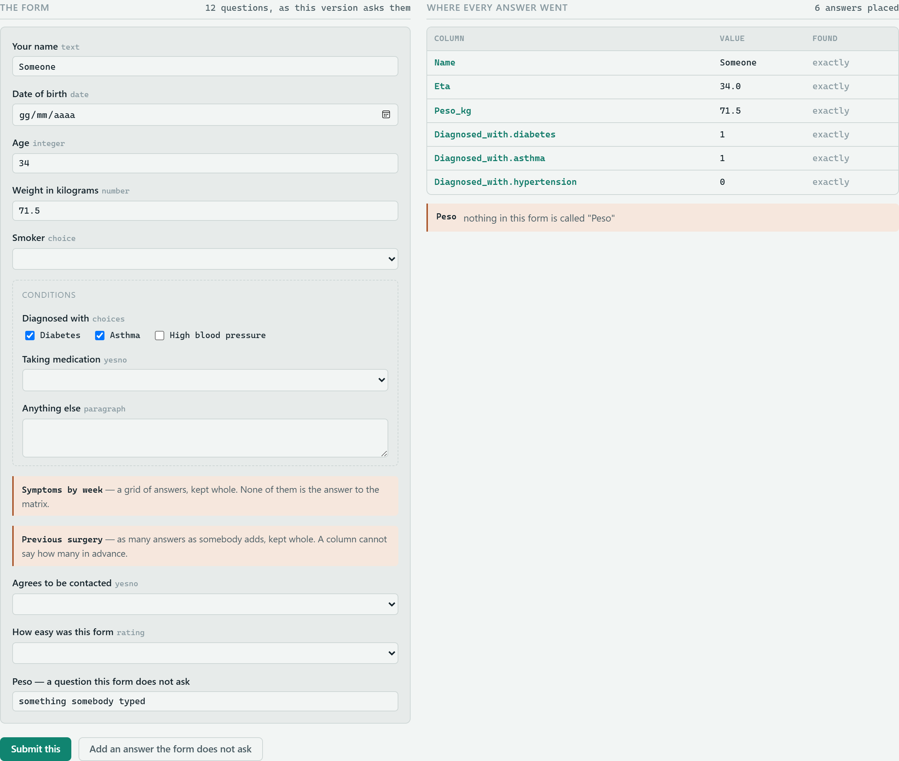
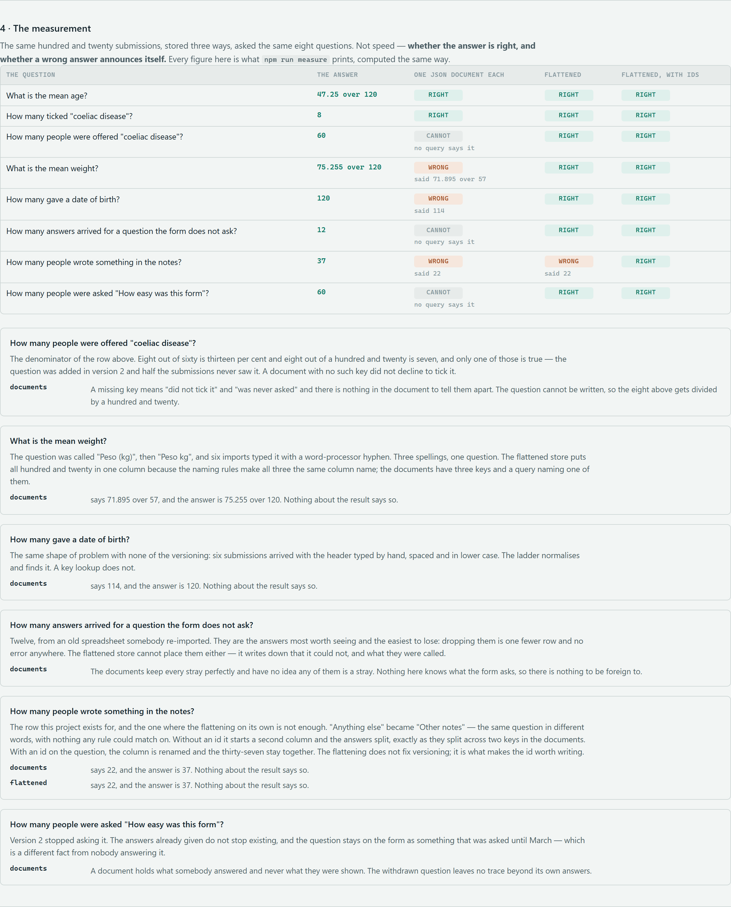

# Dynamic Form Builder

**A form is authored as a tree and asked about as a table. Everything difficult
lives in the gap.**

Somebody drags questions around until the form looks right. It is a tree:
pages hold panels, panels hold questions, a checkbox holds a list of choices, a
matrix holds a grid, a repeating group holds as many answers as the person
filling it in decided to add. Then a submission arrives and the form is over —
and from that moment every question anybody asks is a table question. How many
answered it. What is the average. How many of the people who were *shown* it
ticked the third choice. Has this question been asked since March.

This is a small system that takes the tree and works out the table: what
becomes a column, what cannot, what happens to the answers when somebody
renames a question in version two, and — the part that took the longest — how
to be honest about the answers it could not place.

It comes with a **measurement**, and the measurement is the point. The same
hundred and twenty submissions are stored three ways and asked the same eight
questions, and what is measured is not speed. It is whether the answer is
right, and **whether a wrong answer announces itself**.

|                                                     | one JSON document each | flattened | flattened, with ids |
| --------------------------------------------------- | ---------------------- | --------- | ------------------- |
| right                                                | 2                      | 7         | **8**               |
| wrong, and nothing about the result says so          | 3                      | 1         | 0                   |
| cannot express the question at all                   | 3                      | 0         | 0                   |

`npm run measure` prints that table and then explains every row that is not
green. So does the console, on the page, without a terminal.



---

## Before you start

**Node 24 or newer**, and nothing else.

```
node --version        # v24.19.0 here; anything 24.x or above will do
```

Node 24 because the store is [`node:sqlite`](https://nodejs.org/api/sqlite.html),
which is in the runtime and unflagged from 24. That is the whole reason for the
floor. The CI runs the tests on 24 and on 25, so the claim is checked rather
than asserted.

**No external services.** No database to install, no API key, no account, no
network access after `npm install`. Every form, question and submission is
invented in `src/fixtures/`, and the store is in memory — nothing is written to
disk and nothing survives the process.

**One dependency, and only for the checks.** `playwright-core` is a
`devDependency` used by `npm run check:screen` and `npm run screenshots`, which
drive a real browser. It is about 2 MB. It expects Microsoft Edge, which is
already on Windows; on another platform pass `--show` or point it at a Chromium
you have. If it is missing, those two commands exit **2** and say so — neither
passing nor failing, because a check that did not run is not a check that
passed. Everything else — the tests, the measurement, the service, the page —
runs with no dependencies at all.

**Disk and network.** `npm install` fetches one package: about 2 MB
downloaded, about 5 MB on disk including `node_modules`. The repository itself
is under 3 MB, most of it the pictures in `docs/`.

**To put the machine back:** delete the folder. Nothing is installed globally,
no service is registered, no port is held after the process stops, and nothing
is written outside the repository.

---

## Running it

```
git clone https://github.com/riccardosapuppo/dynamic-form-builder.git
cd dynamic-form-builder
npm install
npm start
```

`npm start` starts the service on `127.0.0.1:4000` **and opens the console in
your browser.** If you would rather it did not, `npm start -- --no-open`, and
`--port 4001` if something already has 4000. It does not open a browser in CI,
or when nothing is attached to the terminal.

Everything below is also a command:

```
npm test                 56 tests, no browser, about three seconds
npm run measure          the three stores, the eight questions, and the findings
npm run check:screen     drives the console in a real browser — 49 checks
npm run check:serving    what the service actually sends — 37 checks
npm run check:mark       the mark in the header and the mark in the tab
npm run screenshots      regenerates every picture in docs/
```

---

## What the console does

The argument above is a sentence, and a sentence is easy to nod at. The console
puts the tree and the table side by side and lets you move the tree.

### 1 · Edit the definition, and watch the columns change under it



Fourteen questions become twelve columns, and the two that are missing are not
an oversight. A matrix of four weeks by three measures is twelve answers and
none of them is *the* answer to the matrix; a repeating group has as many
answers as somebody chose to add. Both are kept whole and marked as such, which
is a worse answer than a column and a much better one than a column that is a
lie.

A checkbox goes the other way: one question becomes one column per choice,
because "how many ticked hypertension" is a question about hypertension.
Hovering one of them lights the rest.

There is a preset for a form somebody typed in a hurry — two questions that
collide on the same column name, one whose name is nothing but punctuation, a
kind nobody has heard of, and a list of choices with nothing in it. None of
those stops the form being saved and every one of them is named:



### 2 · Save a second version, and see what it decided

An attribute belongs to the **form**, not to the version. A question that is
still being asked keeps its column and every answer already in it; a question
that is no longer asked is *withdrawn*, never deleted, because people answered
it and a form not asking a question does not unask it.

Then somebody renames a question. `Anything else` becomes `Other notes` — the
same question in different words, with nothing in the two names that any rule
could match on:



Two columns, and the answers split. That is not a failure of the code. It is
the honest result, and inventing a match would be worse. Now the same edit, on
definitions that give every question an id:



One line in the definition, and it is the difference between a rename that
keeps its answers and one that quietly starts again. **The flattening does not
fix versioning. An id fixes versioning, and the flattening is what makes the id
worth having.** The console lets you do it in both orders, including the
realistic one — add the ids to a form that already has answers in it, then
rename.

### 3 · Fill it in, and watch every answer land



Answers do not arrive with column names on them. They arrive keyed by whatever
the form called the question at the time, which is a moving target: `Peso (kg)`
in version 1, `Peso kg` in version 2, `Peso‐kg` from a spreadsheet somebody
re-imported with a word-processor hyphen in it. So there is a ladder — exact,
then normalised, then loose — and every answer records **which rung found it**,
because "we matched 94% exactly" is a sentence somebody can act on and "it
worked" is not.

The ladder has exactly one thing it must refuse: a loose key that two different
questions answer to. Guessing there puts one person's answer under another
person's question, and that is invisible afterwards.

And an answer to a question the form does not ask is **written down**, with
what it was called and why it could not be placed. Twelve of them in the
measurement. Dropping them would be one fewer row and no error anywhere, which
is exactly why they are the most useful thing this produces.

---

## The measurement



Three stores, identical input, eight questions somebody would ask in the first
week. The expected answers are computed in `src/measure/truth.js` by looping
over the fixture array in plain JavaScript — no query, no import from the store
or from `src/answers/`, nothing that could be wrong in the same way the thing
being measured is wrong. A test checks that file's imports for exactly that, and
`npm run measure` exits non-zero if the flattened store with ids gets anything
wrong.

**The pile of JSON documents is not a straw man.** It is what anybody sensible
builds first, it takes an afternoon, it never loses an answer, and SQLite's
`json_extract` answers a surprising number of questions. It gets the mean age
right and it counts a checkbox correctly. The measurement says so, because a
comparison that only shows one side losing is an argument.

What it gets wrong is worth reading in full:

- **the mean weight** — it says `71.895 over 57`. The answer is
  `75.255 over 120`. Three spellings of one question, and a query naming one of
  them. Nothing about the result says so.
- **how many were offered a question** — it cannot say. A missing key means
  "did not tick it" and "was never asked", and there is nothing in the document
  to tell them apart. So eight people with coeliac disease gets divided by a
  hundred and twenty instead of by the sixty who were shown the question:
  thirteen per cent becomes seven.
- **how many answers arrived for a question the form does not ask** — it cannot
  say. It keeps every one of them perfectly and has no idea any of them is a
  stray, because nothing there knows what the form asks.

And the row where flattening alone is **not enough**: the rename. Without an id
the flattened store says 22, which is exactly what the documents say, and for
exactly the same reason.

---

## What it does not do

A list of real limits, because a portfolio piece without one is a brochure.

- **It is not a form builder.** There is no drag-and-drop editor. The
  definition is JSON in a textarea. Everything interesting here is what happens
  to the definition *after* somebody has written it, and a canvas with handles
  on it would be a week of work that demonstrated nothing.
- **The store is in memory and single-process.** `node:sqlite` on `:memory:`.
  There is no migration story, no connection pool, no concurrent writer. Add a
  file path and most of it survives; add a second process and none of it does.
- **A matrix and a repeating group are kept whole, and that is a dead end.**
  They are stored as JSON with a note saying why, which is honest and is not a
  solution. A real system gives each of them a child table, and that is a
  different project — a bigger one, and the reason this one draws the line where
  it does rather than pretending the line is not there.
- **The renaming rules are not the only possible rules.** `Peso (kg)` and
  `Peso kg` both become `Peso_kg` here. That is a choice, it is occasionally
  wrong, and when it is wrong it is wrong quietly. The collision report exists
  because of it.
- **No authentication, no multi-tenancy, no audit trail.** Localhost, one
  person, one process.
- **Eight questions is not a benchmark.** They are eight questions chosen
  because they separate the three stores. A different eight would produce a
  different table, and the honest claim is the narrow one: on these eight, the
  document store is quietly wrong three times.
- **The submissions are deterministic and invented.** No clock, no randomness at
  run time, and no real form, clinic or person anywhere in this repository.

---

## How it is put together

```
src/form/kinds.js          what each kind of question is, and how a value reads
src/flatten/attributes.js  the tree becomes columns; what cannot, and why
src/flatten/match.js       an answer finds its column: exact, normalised, loose
src/flatten/identity.js    is this new question one the form already had?
src/store/db.js            forms, versions, attributes, submissions, answers
src/answers/ask.js         the questions somebody asks, each one a SELECT
src/blob/documents.js      the other way: one JSON document per submission
src/measure/truth.js       the right answers, in plain JavaScript
src/measure/questions.js   the eight questions, and how each store is asked
src/http/api.js            the service, node:http and nothing else
public/                    the console: no framework, no build step
```

`match.js` and `identity.js` are deliberately separate and were once the same
code. They are opposite disciplines. Matching an **answer** to a question may be
generous, because the alternative to a loose match is a lost answer. Deciding
whether a **question** is one the form already had must not be, because a wrong
match there merges two questions into one column and puts two people's answers
in the same cell, and nothing afterwards can unpick it. Every column of a
checkbox carries the same question name, so the shared version matched a newly
added choice against an existing one and reported a rename that had not
happened.

---

## About the original

The original was built for a client and lives in a private repository. This is
an independent reimplementation, written from scratch with synthetic data.

That original was a **SurveyJS** application: the client's staff built forms in
the SurveyJS Creator, submissions arrived as SurveyJS JSON, and the reporting
was the problem — the answers were documents and every question anybody asked
was a table question. The work was the layer in between.

**This repository contains no SurveyJS and no third-party code at all**, which
is a deliberate difference rather than an omission. Vendoring a form library
here would have added a hundred megabytes of dependencies and hidden the only
part worth reading: the definition format in `src/fixtures/forms.js` is a
simplified one of my own, in the same shape — pages, elements, panels, choices —
and the flattening does not know or care which library produced it. What the
original did with a real SurveyJS schema, this does with a schema you can read
in one sitting.

The two things this has that the original did not: the **measurement**, which
puts a number on the claim rather than asserting it, and the fact that a
question renamed with an id keeps its answers, which the original learned the
hard way and after the fact.

---

## Licence

MIT — see [LICENSE](LICENSE).

Developed by Riccardo Sapuppo.
